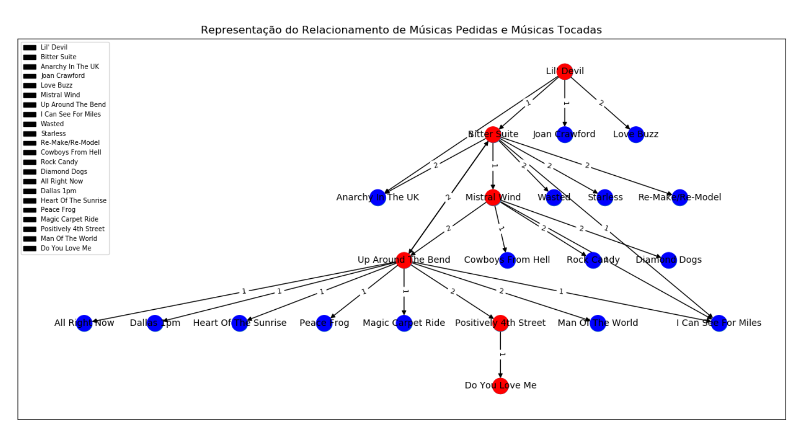
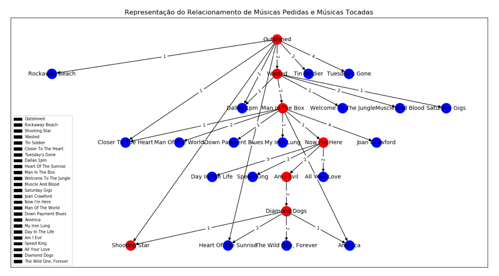

# Representação do Relacionamento de Músicas Pedidas vs Tocadas (Grafo)
Grafo/Python/Metworkx

## Motivação
A fim de melhorar a interação com os ouvintes de uma rádio para maximizar a quantidade de ouvintes, seria possível atravês da teoria dos grafos identificar como se dá o relacionamento das musicas tocadas em função das músicas solicitadas de forma a identificar possívies músicas muito solicitadas que forão deixadas ao acaso assim como sugerir proativamente uma programação baseada no histórico de solicitações ? 

## Desafio

## Abordagem
1. Criar um algoritimo em python para simular uma sequencia de programação de musicas aleatórias dentro de um amostra de 100 músicas a serem tocadas na rádio (Coordenador Musical)

2. Criar um algoritimo em python para simular as solicitações dos ouvintes incrementando o 'peso' para as músicas mais solicitadas em cada sequencia da programação

3. Utilizar o pacote Networkx para a estruturação dinâmica do grafo, da seguinte forma:
    - (vertíce vermelha) - Representa a escolha do coordenador musical
    - (vertice azul) - Representa as solicitações dos ouvintes
    - Nas arestas está representado o número de solicitações em cada sequencia

## Solução

Utilização da função DiGraph() do pacote Networkx para modelar um digrafo (grafo direcionado)

## Estrutura da Solução

## Resultado

Nesta representação é fica visivel que já na segunda sequencia muito embora a maioria dos pedidos estivessem apontando para a música 'Love Bluzz' a rádio reproduziu outra com menor peso e este comportamento foi replicado para várias das sequencias abaixo, desta forma a programação tende a ficar mais distante do público

	

	
</p

